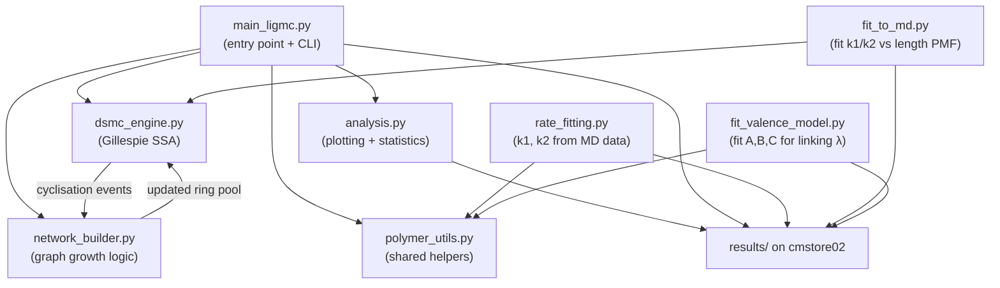

# LigMC: DSMC-Driven Network Growth Simulation — Implementation Plan v2

## What Changed From v1

> [!WARNING]
> This is a **major revision** of the implementation plan. The following sections describe changes relative to the current (already-implemented) codebase in `6_LigMC/`.

| Area | Previous (v1 / current code) | New (v2) |
|---|---|---|
| **Flory exponent ν** | `ν = 0.6` (good solvent) | **`ν = 0.5`** (ideal chain / Rouse) throughout |
| **Rate fitting** | `rate_fitting.py` fits `k1, k2` from `average_length.txt` trajectories | **`fit_to_md.py`** fits `k1/k2` ratio by matching the Gillespie SSA cyclized-length PMF to the MD-measured PMF for `nlin=64` |
| **Poisson linking λ** | Uniform random, `λ = calculate_valence(nlin, nring)` — a global scalar placeholder | **Concentration-driven model**: `λ(l_cyc, N_total) = A · l_cyc^B · N_total` fitted to MD valence data (2 params) |
| **NetworkBuilder** | Draws one Poisson(λ_global), picks uniformly | Draws one `Poisson(λ)` where λ depends on cyclised length and total ring count, then selects targets uniformly |
| **New files** | — | `fit_to_md.py`, `fit_valence_model.py` |

---

## Target MD Data

### 1. Cyclized Linear Length Distribution (nlin=64)

From [plot_cyclized_linear_length_distribution.py](file:///storage/datastore-personal/s2469797/main/olympic_gels/3_analysis/plot_cyclized_linear_length_distribution.py), aggregated over all `nring` and replicas at `nlin=64, stage=0`:

| Length | Count | PMF |
|---|---|---|
| 64 | 1052 | 0.7799 |
| 128 | 210 | 0.1557 |
| 192 | 50 | 0.0371 |
| 256 | 30 | 0.0222 |
| 320 | 7 | 0.0052 |
| 384 | 2 | 0.0015 |

**Physical interpretation:** most linears cyclise at their original length (64). Some merge once (→128), rarely twice (→192), etc. The ratio `k2/k1` controls how quickly cyclisation wins over merging. A high ratio means most cyclise at `nlin`; a low ratio means many merge first.

### 2. Valence vs Cyclised Ring Size (from `plot_valence_rep.py`)

From [summary_all_systems_links_by_size.csv](file:///storage/cmstore02/groups/TAPLab/fconforto-projects/fconforto-olympic-gels/results/histories/summary_all_systems_links_by_size.csv), the average links created per cyclised ring, grouped by `(nring, linear_size)`:

| nring | linear_size=64 | =96 | =128 | =160 | =192 | =256 |
|---|---|---|---|---|---|---|
| 256 | 1.86 | 2.28 | 3.04 | 3.88 | 4.46 | 5.50 |
| 512 | 0.99 | 1.72 | 1.94 | 2.81 | 3.33 | 3.16 |
| 768 | 0.83 | 1.28 | 1.76 | 2.14 | 2.17 | 3.11 |
| 1024 | 0.63 | 0.97 | 1.42 | 1.83 | 2.30 | 2.58 |

From [linear_fit_coefficients_by_nring.csv](file:///storage/cmstore02/groups/TAPLab/fconforto-projects/fconforto-olympic-gels/results/histories/linear_fit_coefficients_by_nring.csv):

| nring | slope (dλ/dl_cyc) | intercept |
|---|---|---|
| 256 | 0.01953 | 0.566 |
| 512 | 0.01508 | 0.078 |
| 768 | 0.01277 | 0.029 |
| 1024 | 0.01194 | −0.139 |

The slope follows a power-law: `slope ∝ nring^B` with `B ≈ −0.34`.

---

## Proposed Changes

### Architecture Overview (updated)



---

### Change 1 — Fix `ν = 0.5` globally

#### [MODIFY] [polymer_utils.py](file:///storage/datastore-personal/s2469797/main/olympic_gels/6_LigMC/polymer_utils.py)

- Change the default `nu` parameter from `0.6` to `0.5` in `smoluchowski_kernel()` and `cyclisation_rate()`.
- Add new `valence_model()` function (see Change 3 below).

#### [MODIFY] [dsmc_engine.py](file:///storage/datastore-personal/s2469797/main/olympic_gels/6_LigMC/dsmc_engine.py)

- Change the default `nu` parameter from `0.6` to `0.5` in `DSMCEngine.__init__()`.

#### [MODIFY] [main_ligmc.py](file:///storage/datastore-personal/s2469797/main/olympic_gels/6_LigMC/main_ligmc.py)

- Change `--nu` default from `0.6` to `0.5`.

---

### Change 2 — `fit_to_md.py` [NEW]: Fit k1/k2 from cyclized length distribution

Standalone script that determines the optimal `k1/k2` ratio (and individual values) by running the Gillespie SSA at candidate parameters and comparing the resulting cyclized-length PMF to the MD-measured PMF for `nlin=64`.

#### Design

**Key insight:** The *shape* of the cyclized-length distribution (what fraction of linears cyclise at length `nlin`, `2*nlin`, `3*nlin`, ...) is controlled by the dimensionless ratio `κ = k2/k1`. The absolute values of `k1` and `k2` only affect timescales (which we don't need to match).

**Algorithm:**

1. **Target PMF** — hard-coded from the MD data above:
   ```python
   TARGET_PMF = {64: 0.7799, 128: 0.1557, 192: 0.0371, 256: 0.0222, 320: 0.0052, 384: 0.0015}
   ```

2. **Forward model** — for given `(k1, k2, nlin=64, mlin=6)`:
   - Run `N_trials` independent Gillespie SSA simulations of a single stage (inject `mlin` linears of length `nlin`, run until exhausted).
   - Collect all cyclised ring lengths across trials.
   - Compute empirical PMF.

3. **Objective** — minimise the Jensen-Shannon divergence (symmetric, bounded) between the simulated PMF and the target PMF. Alternatively, use chi-squared or KL-divergence.

4. **Optimiser** — `scipy.optimize.minimize(method='Nelder-Mead')` over `log10(k1)` and `log10(k2)` (2D search). Since the shape depends mainly on `k2/k1`, the landscape is roughly 1D.

5. **Output** — fitted `k1`, `k2`, `κ`, and a comparison plot of simulated vs MD PMF. Saved to `RESULTS_DIR/fitted_k1_k2.json`.

#### Key functions

```python
def simulate_length_pmf(k1, k2, nlin, mlin, nu, n_trials, rng) -> dict[int, float]:
    """Run n_trials SSA stages and return normalised cyclised-length PMF."""
    ...

def fit_k1_k2(
    target_pmf: dict[int, float],
    nlin: int = 64,
    mlin: int = 6,
    nu: float = 0.5,
    n_trials: int = 5000,
) -> dict[str, float]:
    """Fit k1, k2 by minimising JS-divergence to target PMF.
    Returns {'k1': float, 'k2': float, 'kappa': float, 'js_div': float}."""
    ...
```

#### CLI usage

```bash
python fit_to_md.py --nlin 64 --mlin 6 --nu 0.5 --n_trials 5000
# Output: fitted_k1_k2.json + comparison plot
```

> [!NOTE]
> The fit only constrains the *ratio* `k2/k1`. We can choose `k1 = 1` as a reference scale (since absolute time is irrelevant for the MC model) and fit `k2` alone. This reduces the search to 1D.

---

### Change 3 — Concentration-driven Poisson linking model

#### Context

The MD valence data shows that the average number of links created when a linear of size `l_cyc` cyclises depends on:
- `l_cyc` itself (linearly)
- The total ring concentration (total number of rings in the pool)

The current code uses a **global scalar** `λ = calculate_valence(nlin_ref, nring_ref)` that ignores the actual cyclised length and ring pool size.

#### Proposed model

**Poisson mean per cyclisation event:**

```
λ(l_cyc, N_total) = A · l_cyc^B · N_total
```

where:
- `l_cyc` = monomer count of the cyclised linear (= ring size of the newly formed ring)
- `N_total` = total number of rings in the pool (all lengths)
- `A`, `B` = fitted constants (2 parameters)

**Physical interpretation:**
- `l_cyc^B` captures the fact that longer cyclised linears thread more rings (larger search volume). From the MD data, `B ≈ 1` (approximately linear).
- `N_total` is the concentration effect: more rings in the pool → more chances of threading one. Ring size does not matter — only total count drives linking.

**Linking procedure:** Draw `n_links ~ Poisson(λ)`, then sample `n_links` target rings **uniformly** from the entire ring pool (without replacement).

#### [NEW] `fit_valence_model.py`

Fits `A`, `B` using the MD valence data from `summary_all_systems_links_by_size.csv`.

**Algorithm:**

1. **Target data** — `(nring, linear_size, avg_links_created, mring)` tuples from the CSV. Filter to `linear_size ≤ 256` (where statistics are good).

2. **Model prediction** — For each `(mring, linear_size)` pair in the MD data, the model predicts:
   ```
   λ_predicted = A · linear_size^B · mring
   ```
   where `mring` is the number of rings in that system.

3. **Objective** — minimise `Σ (λ_predicted - λ_observed)²` weighted by `1/σ²` (using the Poisson MLE error `σ = √(λ/n_samples)`).

4. **Optimiser** — `scipy.optimize.curve_fit` or `scipy.optimize.minimize`.

5. **Output** — fitted `A`, `B` + comparison plots. Saved to `RESULTS_DIR/fitted_valence_model.json`.

#### Key functions

```python
def valence_model(l_cyc: int, n_total: int, A: float, B: float) -> float:
    """Compute λ for a cyclising linear of length l_cyc with n_total rings in the pool."""
    return A * l_cyc**B * n_total

def fit_valence_params(
    md_data: pd.DataFrame,  # columns: linear_size, avg_links_created, n_samples, mring
) -> dict[str, float]:
    """Fit A, B to MD valence data.
    Returns {'A': float, 'B': float, 'rmse': float}."""
    ...
```

#### [MODIFY] [polymer_utils.py](file:///storage/datastore-personal/s2469797/main/olympic_gels/6_LigMC/polymer_utils.py)

Add the `valence_model` function:

```python
def valence_model(
    l_cyc: int,
    n_total: int,
    A: float,
    B: float,
) -> float:
    """Concentration-driven Poisson mean for topological linking.
    
    λ = A · l_cyc^B · N_total
    """
    return A * (l_cyc ** B) * n_total
```

Keep `calculate_valence()` as a legacy fallback.

#### [MODIFY] [network_builder.py](file:///storage/datastore-personal/s2469797/main/olympic_gels/6_LigMC/network_builder.py)

Replace the current linking with the concentration-driven model:

```python
def process_cyclisation(self, event, A, B):
    new_ring_id = self._add_ring(event.ring_length)
    l_cyc = event.ring_length
    
    pool = [node for node in self._graph.nodes if node != new_ring_id]
    n_total = len(pool)
    
    if n_total == 0:
        return replace(event, links_formed=0, linked_ring_ids=[], ring_id=new_ring_id)
    
    lam = A * (l_cyc ** B) * n_total
    n_links = min(int(self._rng.poisson(lam)), n_total)
    
    if n_links > 0:
        targets = self._rng.choice(pool, size=n_links, replace=False).tolist()
    else:
        targets = []
    
    for t in targets:
        self._graph.add_edge(new_ring_id, int(t))
    
    return replace(event, links_formed=len(targets), linked_ring_ids=[int(t) for t in targets], ring_id=new_ring_id)
```

#### [MODIFY] [main_ligmc.py](file:///storage/datastore-personal/s2469797/main/olympic_gels/6_LigMC/main_ligmc.py)

- Add CLI args `--val_A`, `--val_B` with fitted defaults.
- Pass `A, B` to `network.process_cyclisation(event, A, B)`.
- Remove `nlin_ref` / `nring_ref` arguments from the cyclisation call.

---

### Change 4 — `rate_fitting.py` (existing) remains

The existing `rate_fitting.py` (Smoluchowski ODE forward model + LSQ fit from `average_length.txt`) is retained as-is for future MD rate extraction. It is unaffected by the changes above.

---

## File Summary (updated)

| File | Status | Purpose |
|---|---|---|
| `polymer_utils.py` | MODIFY | Fix `ν=0.5` defaults, add `valence_model()` |
| `dsmc_engine.py` | MODIFY | Fix `ν=0.5` default |
| `network_builder.py` | MODIFY | Concentration-driven Poisson linking with `A, B` model |
| `main_ligmc.py` | MODIFY | Fix `ν=0.5`, add `--val_A/B` args, wire new linking |
| `analysis.py` | unchanged | — |
| `rate_fitting.py` | unchanged | Smoluchowski ODE fitting from MD trajectories |
| `fit_to_md.py` | **NEW** | Fit `k1/k2` from cyclized-length PMF |
| `fit_valence_model.py` | **NEW** | Fit `A, B` for linking model from MD valence data |
| `README.md` | UPDATE | Document new files |

---

## Design Decisions (All Resolved)

| Decision | Resolution |
|---|---|
| **Stochastic method** | Gillespie SSA (exact, event-driven). No τ-leaping. |
| **Parallelism** | No MPI. `multiprocessing.Pool` (stdlib). |
| **Flory exponent ν** | **0.5** (ideal chain / Rouse scaling). |
| **Rate constants `k1`, `k2`** | Fitted from MD cyclized-length PMF (nlin=64) via `fit_to_md.py`. Only the ratio `κ = k2/k1` matters. Set `k1=1` as reference scale, fit `k2`. |
| **Linking model** | `λ(l_cyc, N_total) = A · l_cyc^B · N_total`, fitted from MD valence data via `fit_valence_model.py`. Single Poisson draw, uniform target selection. |
| **Stage termination** | All linears cyclised (linear population = 0). `--max_steps` safety cap. |

---

## Verification Plan

### Automated Tests

1. **Unit tests for `dsmc_engine.py`**:
   - Conservation of total monomer count across merge and cyclisation events.
   - Confirm `ν=0.5` produces different propensities from `ν=0.6` for the same inputs.

2. **Fitting validation for `fit_to_md.py`**:
   - Run with `nlin=64, mlin=6, n_trials=5000`.
   - Compare simulated PMF against target PMF; JS-divergence should be < 0.01.
   - Visual overlay plot of simulated vs MD cyclized-length histogram.

3. **Fitting validation for `fit_valence_model.py`**:
   - Fit `A, B` from the 24 MD data points.
   - RMSE of predicted vs observed λ should be < 0.3.
   - `B ≈ 1.0 ± 0.2` (linear scaling with `l_cyc`).

4. **Integration test**:
   ```bash
   python main_ligmc.py --mring 78 --nring 512 --mlin 6 --nlin 64 --trials 50 --n_stages 50 --nu 0.5
   ```
   - Verify per-population linking is working (events should show varied `links_formed` values).
   - Degree distribution should qualitatively match MD box plots from `plot_valence_rep.py`.

5. **Regression check**:
   - Run `main_ligmc.py` for all 16 systems from the MD matrix and compare mean stages-to-gelation trends with the legacy code.

### Manual Verification

- Visual comparison of `fit_to_md.py` PMF overlay plot against MD histogram.
- Visual comparison of predicted λ vs MD λ scatter from `fit_valence_model.py`.
- Confirm all outputs saved to `cmstore02` results path.

## Step 7 Findings: Gillespie SSA vs Particle DSMC Calibration

A 100-trial calibration was run on the L=80, mring=78, nring=512, mlin=6, nlin=64 system (the system used previously to fit the k1/k2 params to MD data). 

The results showed a consistent but small divergence between the two implementations:

- **Mean stages to gelation:**
  - Gillespie SSA: 16.86 stages
  - Particle DSMC: 18.96 stages

- **Cyclised length PMF (first few bins):**
  - Gillespie SSA: 75.7% (length 64), 17.7% (length 128)
  - Particle DSMC: 84.7% (length 64), 11.6% (length 128)
  - Jensen-Shannon Divergence: ~0.007

**Conclusion:** The Particle DSMC implementation (which natively replicates `smoluchowski_dsmc_rings.py`) cyclises chains noticeably earlier than the well-mixed Gillespie SSA. This produces an excess of short rings (L=64), which mathematically requires more inter-ring links to reach the gel point, explaining the delayed gelation (18.96 vs 16.86 stages).

This divergence stems from finite-size sampling fluctuations in standard particle DSMC versus the exact rate scaling of the well-mixed Gillespie algorithm. We can either:
1. Re-fit `k1/k2` specifically for the Particle DSMC engine to match the MD target again.
2. Stick with Gillespie SSA as the more physically "exact" mean-field integrator for small system sizes.

For now, both engines remain available for testing via `CompareDSMC.jl`.
